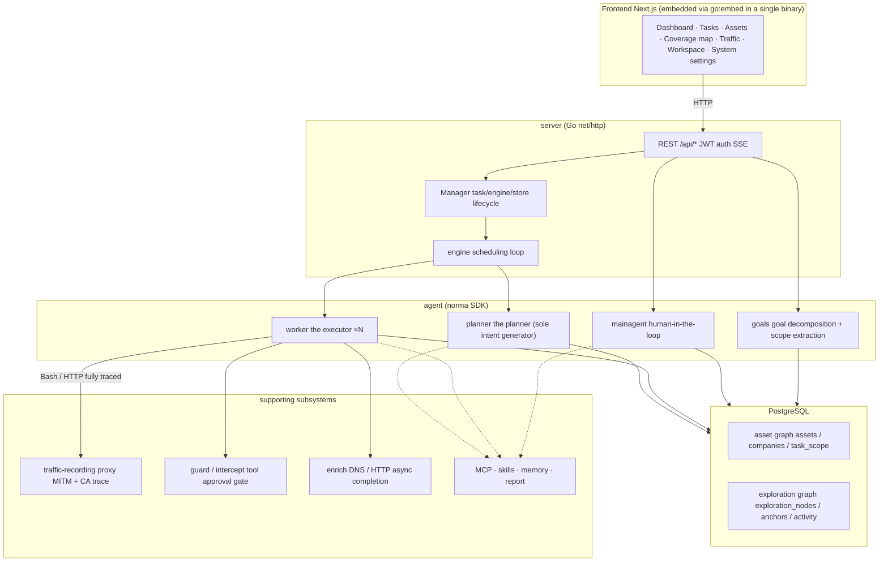
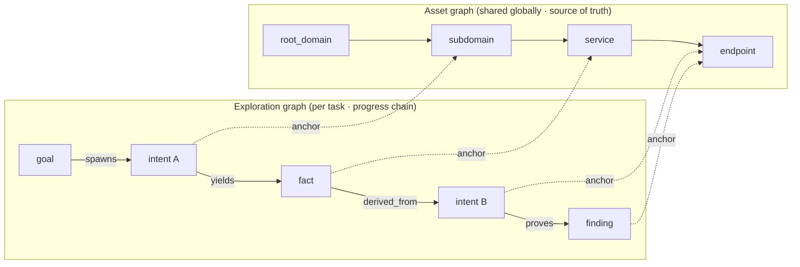
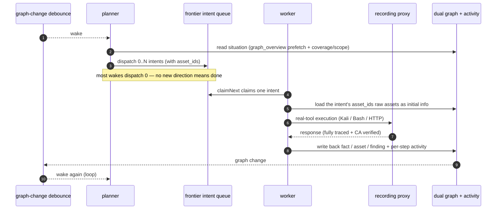
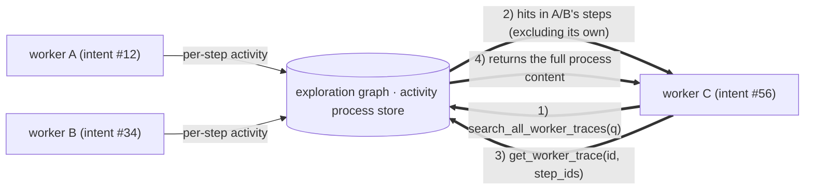
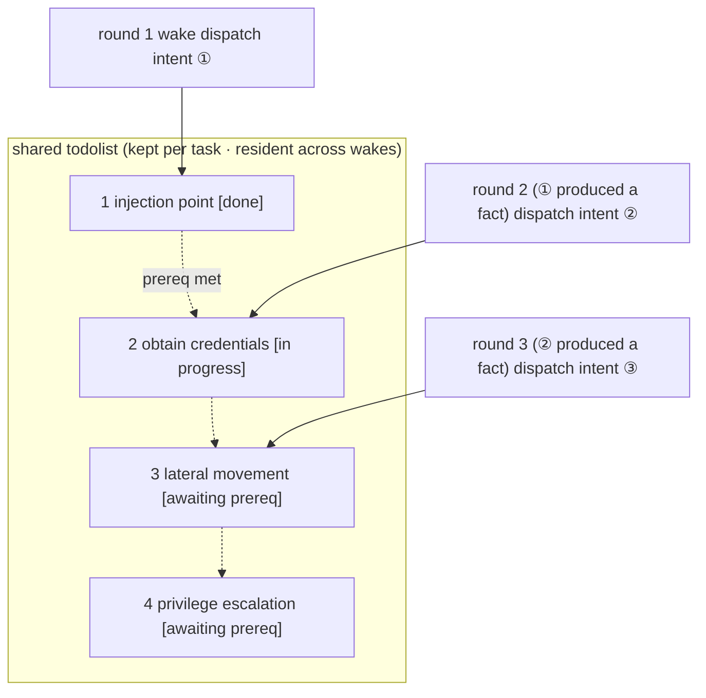

<div align="center">

# ARTEX

AI autonomous penetration-testing system (Go backend + Next.js frontend)


🌐 **Live demo**: [https://artex-demo.vercel.app/](https://artex-demo.vercel.app/)

</div>

---

> **About this fork.** This is an English-language fork of ARTEX: the entire
> codebase, UI, prompts, notifications and docs are maintained in English, and
> the project owner will continue developing in English from here. Two things to
> know: `docker compose up` currently pulls the **upstream** image
> (`autumn27/artex`, which still ships the Chinese UI) until the owner publishes
> their own English image; and the screenshots below still show the Chinese UI
> until they are re-captured. An existing install receives this English build only
> from a release the owner publishes, and must refresh the `skills/` directory
> manually (the in-app updater replaces only the binary). See [Upstream project
> and community](#upstream-project-and-community) for the original project.

---

## Screenshots

> For the full interaction, see the [live demo](https://artex-demo.vercel.app/).

| Dashboard (overview / token usage / activity feed) | Task list |
| :---: | :---: |
|  |  |

| Task · execution trace (sessions / tool calls) | Exploration graph |
| :---: | :---: |
|  |  |

| Findings | Assets |
| :---: | :---: |
|  |  |

| Asset coverage map (force-directed layout · tested highlighted · collapsible nodes) |
| :---: |
|  |

| Traffic recording | Human-in-the-loop chat |
| :---: | :---: |
|  |  |

| Agent management | LLM configuration |
| :---: | :---: |
|  |  |

| Intercept approval | Backend logs |
| :---: | :---: |
|  |  |


---

## Approval record detail

The global "Approval records", a task's "Intercept approval", and the approval
cards in chat all support expanding to view the detail. The layout follows
[AegisHook's call-detail component](https://github.com/RuoJi6/AegisHook/blob/main/web/src/components/CallDetail.vue),
reusing ARTEX's own components and theme:


## Asset sync (ScopeSentry)

ARTEX can sync asset data directly from [ScopeSentry](https://github.com/Autumn-27/ScopeSentry),
avoiding duplicate collection:

- On the "**Asset sync**" page, enter the ScopeSentry address and API key to connect the data source;
- Select the targets and asset types to sync by **project** or by **task** (domain / subdomain / IP / port / site / endpoint, …);
- Import in one click, merged by company asset scope, straight into ARTEX's asset graph for agents to explore.

---

## Installation

> Requires a **PostgreSQL** database; exploration requires an **LLM** (`ANTHROPIC_API_KEY` or `OPENAI_API_KEY`, which can also be configured in the UI).

### Option 1: one-click install script (recommended)

```bash
git clone https://github.com/Autumn-27/ARTEX.git
cd ARTEX
./install.sh
```

The script will detect / auto-install Docker, then let you choose **① all-Docker** or **② local build and run**:

- **① All-Docker**: enter a Postgres password (press Enter for a random one) → it writes `.env` automatically → `docker compose up -d`.
- **② Local run**: choose a database (connect to an existing one / start one with Docker) → generate `config.json` → `go` compiles the embedded single binary → start.

Once installed, open **http://localhost:8787** (the first visit goes to `/setup` to set the admin password).

### Option 2: Docker Compose (manual)

```bash
git clone https://github.com/Autumn-27/ARTEX.git
cd ARTEX
cp .env.example .env          # set POSTGRES_PASSWORD, optionally ANTHROPIC_API_KEY
docker compose up -d          # pulls the autumn27/artex image + postgres
# → http://localhost:8787
```

The image already bundles common tools (ripgrep/curl/vim/npm/nmap, …); `./skills` and `./data` are persisted via bind mounts.

A remote MCP can be configured in System settings as `http` (Streamable HTTP) or `sse` (legacy SSE).
A legacy SSE service typically opens the event stream with `GET /sse` and then receives JSON-RPC requests
through the service-returned `/message?sessionId=...`; set the URL to `/sse` and set the header as
`Authorization=Bearer <token>`.

### Option 3: download a prebuilt binary (Releases)

Download the zip for your platform from [Releases](https://github.com/Autumn-27/ARTEX/releases); unpacking it gives you `artex` + `start.sh` (`start.bat` on Windows) + `skills/` + `config.example.json`:

```bash
cp config.example.json config.json   # fill in the database connection
./start.sh                           # → http://localhost:8787
```

> Start it with `start.sh` / `start.bat`, not by running `./artex` directly. It is a supervisor script: after the program exits, it decides from the exit code whether to relaunch, and **the [one-click update](#option-1-in-app-one-click-update-recommended) in the UI relies on it to swap the binary**. Running `./artex` directly means it is not relaunched after an update.
> To keep it running in the background: `nohup ./start.sh >artex.log 2>&1 &`.

### Option 4: build a single binary from source

```bash
# 1) static export of the frontend
cd web && npm ci && npm run build:static && cd ..
# 2) copy it into the embed directory
cp -r web/out server/webui/dist
# 3) build (-tags embedui embeds the frontend)
CGO_ENABLED=0 go build -tags embedui -o artex ./cmd/artex
./start.sh
```

### Option 5: build cross-platform release archives

`build.sh` first builds and embeds the frontend, then uses the Go linker to strip debug info and compresses the release files into zips. Release mode produces zips for Linux amd64/arm64, macOS amd64/arm64 and Windows amd64 by default:

```bash
./build.sh --release
# output: dist/artex-0.3.3-*.zip
```

A UPX self-extracting binary can be incompatible with some Linux kernels, virtualization environments or security policies, so it is off by default. Use `ARTEX_TARGETS` to customize targets; when you have confirmed the target environment is compatible, pass `--upx` explicitly to shrink the binary further:

```bash
ARTEX_TARGETS=linux/amd64,windows/amd64 ./build.sh --release
./build.sh --target linux/amd64 --upx
```

---

## Updating / upgrading

> An upgrade swaps only the program, not the data: the Postgres data volume `pgdata`, `./data` (jwt.key / SQLite, etc.) and `./skills` are all preserved. **No manual database migration is needed** — `artex` idempotently re-runs `schema.sql` on every start (including `ADD COLUMN` / `CREATE INDEX IF NOT EXISTS`), i.e. "restart is migrate". Still, back up `./data` and the database before upgrading.

### Option 1: in-app one-click update (recommended)

On the **System settings** page (sidebar "System settings" → `/system/settings`), the **Version and updates** card lets you check for and install a new version directly, without logging into the server.

After you click "Update": it downloads the release package for the current platform → compares against the release's `SHA256SUMS` → smoke-tests the new binary with `-h` → stages it as `artex.new` → the program exits, and `start.sh` / `start.bat` relaunches and completes the swap. The page waits and refreshes automatically once the new version is up.

- **A failure never leaves a broken program**: if verification or the smoke test fails, the staged file is discarded and the current version keeps running; if the swapped-in new version fails to start 3 times in a row, it automatically rolls back to `artex.old` (the failing one is kept as `artex.failed` for diagnosis).
- **You can roll back at any time**: the previous version is kept as `artex.old`, and the card has a "Roll back to the previous version" action. Note that the database schema is not rolled back.
- **An update interrupts running tasks** — an update means a restart, so do it when idle.
- **Dev builds do not update**: it is disabled when the version is `dev` or when `git describe` has a suffix, to keep a release build from overwriting a locally debugged binary.
- **Under Docker, only the program is swapped, not the image**: tool chains in the image (playwright / nmap, etc.) are not upgraded along with it, and once `docker compose up -d` rebuilds the container it reverts to the version bundled in the image. To upgrade the image too, still use `docker compose pull artex && docker compose up -d artex`.
- If reaching GitHub needs a proxy, configure a **global proxy** on the same page and the update path will use it. Updates download only from GitHub domains and force HTTPS.

### Option 2: one-click update script

```bash
cd ARTEX
./update.sh
```

The script optionally runs `git pull` to fetch the latest code first, then lets you choose **① Docker update** or **② local build update** (matching `install.sh`):

- **① Docker**: you can specify a target image tag (Enter reuses `.env`'s `ARTEX_TAG`, defaulting to `latest`) → `docker compose pull` → `docker compose up -d` (restarting with the new image auto-migrates).
- **② Local**: rebuild the frontend static output → recompile `./artex` (restart the process afterward to take effect).

### Option 3: Docker Compose (manual)

```bash
cd ARTEX
git pull                       # update compose / scripts (optional)
# pin a version: set ARTEX_TAG=v0.2.0 in .env; otherwise latest is used
docker compose pull artex
docker compose up -d artex     # restart with the new image → auto-migrate schema
docker image prune -f          # clean up old images (optional)
```

### Option 4: prebuilt binary (Releases)

Download the new version zip from [Releases](https://github.com/Autumn-27/ARTEX/releases), stop the old process, overwrite `artex` and `skills/` (keeping your `config.json` and `data/`), and restart:

```bash
cp -r <unpacked dir>/skills ./ && cp <unpacked dir>/artex ./
./start.sh
```

### Option 5: build from source

```bash
git pull
cd web && npm ci && npm run build:static && cd ..
cp -r web/out server/webui/dist
CGO_ENABLED=0 go build -tags embedui -o artex ./cmd/artex
# restart ./start.sh
```

---

## Configuration

**Database** (`config.json`, or override with the `ARTEX_PG_DSN` environment variable):

```json
{
  "database": {
    "host": "127.0.0.1", "port": 5432,
    "user": "artex", "password": "yourpass",
    "dbname": "artex", "sslmode": "disable"
  }
}
```

**LLM**: `export ANTHROPIC_API_KEY=sk-...` (or `OPENAI_API_KEY`), or fill it in on the UI's "LLM configuration" page.
Optional: `ARTEX_LLM_PROVIDER` / `ARTEX_LLM_MODEL` / `ARTEX_LLM_BASE_URL` / `ARTEX_LLM_PROXY`.

**Concurrency**: the number of work agents per task is configured in "System settings" (default 3).

**Common flags**: `./start.sh -addr :8787 -proxy :8788` (`-addr` is frontend + API, `-proxy` is the traffic-recording proxy). The start script passes the flags straight through to `artex`.

---


## Development

### Manual finding retest

The "Retest" tab of a task's detail lets you page through this task's findings, view past verdicts and evidence, and start a retest manually. Once started it keeps the current tab and shows a spinner and "Retesting"; after a fix is confirmed, the finding status is updated in sync.

Click "Retest" in the per-row action area of the finding list, or click "Start retest" in the "Finding retest" area of a finding's detail, and fill in the optional fix version, test conditions or limits; the system creates an independent retest Agent session and keeps the current page after starting. The flat, group-by-task and asset views of the list all support this entry point; while a retest is running it shows a spinner and "Retesting", and you click in to view the session when needed, returning to "Retest" once finished. A retest does not need the original scan task to be restarted; the verdict is one of "Still reproducible", "Fixed" or "Inconclusive", and each verdict, its evidence and session link are saved in the finding's detail.

On its first start, the new backend seeds an editable "Finding retest" (`retester`) Agent, whose prompt, LLM, run budget and tools can be configured in Agent management. It uses its bound LLM by default, or the globally active configuration if unbound. When a retest session completes successfully with a verdict of "Fixed", the system automatically changes the finding's disposition to "Fixed"; an in-progress, failed, stopped or other verdict keeps the original status. The original evidence and report are always preserved. You can also pick "Fixed" manually from the status dropdown. While a finding is being retested, an existing session is reused; after a stop, failure or service restart you can start a new one.

This version's history is viewed through the finding detail and the session; it is not yet included in the finding-report export or the task archive package, and traffic is not auto-linked. Demo mode only generates clearly labeled mock records and does not reach a real target.

### Local run and tests

```bash
./dev.sh    # backend (:8787) + traffic proxy (:8788) + frontend next dev (:5173) → http://localhost:5173
```

- Backend: `go run ./cmd/artex` (without `-tags embedui` the frontend is not embedded)
- Frontend: `cd web && npm run dev` (`/api` is reverse-proxied to the backend, with hot reload)
- Tests: `go test ./...`
- Mock preview (no backend): `cd web && NEXT_PUBLIC_MOCK=1 npm run dev`

---

## System architecture

ARTEX is an **LLM multi-agent-driven autonomous pentest system**: a single Go backend (with the Next.js frontend embedded) + PostgreSQL, with agent capabilities provided by the [`norma`](https://github.com/Autumn-27/norma) SDK (`agentcore` / `tool` / `permission` / `harness` / `memory` / `transcript`). At its core is a **dual-graph architecture**, and two autonomy mechanisms built around it: **process-level information exchange between workers** and **the planner's multi-round shared todolist for a stable attack chain**.

### Overall layers



| Layer | Responsibility |
| --- | --- |
| **Frontend** | Next.js static export, embedded into the single binary via `go:embed`; visualizes tasks/assets/exploration graph/coverage map and the human-in-the-loop chat |
| **server** | `net/http` routing + JWT auth + SSE; `Manager` owns the lifecycle of tasks, the engine and the DB stores |
| **engine** | one `plannerLoop` + N worker goroutines per task; intent claiming, timeout/pause/drain |
| **agent** | goals / planner / worker / mainagent; `ToolSet` exposes the dual graph as LLM tools |
| **db** | Postgres persistence of the dual graph (pgx); schema idempotently created on every start via `go:embed` |
| **supporting** | recording MITM proxy, approval gate, async completion, MCP/skills/memory/report |

### Dual-graph architecture: exploration graph + asset graph

The system splits "**what the target is**" from "**how far it has been tested**" into two graphs that are independent yet linked by anchors:

- **Asset graph (shared globally)**: the cross-task single source of truth for assets. Nodes are `root_domain / subdomain / ip / service / app / endpoint`, owned by a company; the domain → subdomain → service → endpoint parent/child relationships and the dedup keys are all computed by the program, and the agent only submits raw information.
- **Exploration graph (per task)**: the "thinking and progress" process of one task. Nodes are `goal / intent / fact / finding / hint`, connected by `spawns / derived_from / yields / proves` edges into a **lineage chain**, answering "which direction was derived from which facts, and produced what".
- **The two graphs are linked by anchors**: `exploration_anchors(node_id, asset_id)` anchors an intent/fact/finding to a concrete asset — so you can both see which assets an "exploration direction" is hitting, and, from "a given asset", look up which intents tested it in this task and what facts they produced. This also powers **asset test coverage** and the **asset coverage map** (in-scope assets + tested highlighted).



> Division of labor: **planner** reads the exploration-graph situation, judges goals, and dispatches an **intent** into the frontier only when there is an uncovered new direction; **worker** claims **one intent**, executes it with real tools, writes the new assets/facts/findings back to both graphs, and stops. The asset graph is the shared truth; the exploration graph is each task's progress chain.

### Engine and intent lifecycle (the loop of one exploration)

The engine is an **event-driven** loop: a graph change wakes the planner, the planner dispatches intents, a worker claims and executes an intent and writes back, and the write-back triggers the next round — until the goal is proven (`prove_goal`).



### Process-level information exchange between workers

In a deep exploration, many valuable observations (an error, a response fragment, a hidden parameter) appear in one worker's **execution process** but are not necessarily written up as a formal fact. To avoid duplicated work and let workers along a chain stand on each other's shoulders, a worker can **search across other works' processes**:

- `search_all_worker_traces(q)`: keyword-search **the execution processes of other works in this task** (automatically excluding this intent's own steps); hits carry an `intent_id`;
- `list_worker_traces` / `get_worker_trace(intent_id, step_ids=[…])`: first see which works have run, then fetch the full content of specific steps of a work to exchange details.

This way, even when the exploration graph has no corresponding fact yet, a later worker can reuse another's in-process observations — **information flows between workers at the granularity of the "execution process"** — while the boundary stays fixed (each worker still only works the one intent it claimed).



### Planner's multi-round shared todolist → a stable attack chain

A real attack chain is often a **multi-step sequence with dependencies** (e.g. find an injection point → obtain credentials → move laterally → escalate privileges); dispatching all of these in parallel at once only creates chaos. The planner therefore holds a **planning todolist that is kept per task and shared across wakes**:

- The planner is event-driven — a graph change wakes it, but **each wake is a fresh session**; the shared todolist lets it **record a serial exploitation chain once** and then **dispatch intents step by step over later rounds**, instead of expanding the whole chain up front in a single round;
- Each round it dispatches an intent only for the next step whose "prerequisite steps are done and the facts they depend on exist", and updates the list as it progresses (marking steps already satisfied by a fact as done).



So the attack chain still **progresses stably, without duplication or misordering** in an "event-driven + stateless session" environment — this is the key to ARTEX walking a multi-step exploitation chain autonomously.

---

## Upstream project and community

This English fork is based on the upstream project by Autumn-27. For the original
(Chinese) project and its community:

Scan and follow the WeChat official account **SecSentry**, then send a direct
message in the account's backend to join the discussion group.

<div align="center">


</div>

---
## References

https://github.com/oritera/Cairn


## License and disclaimer

### Open-source license

This project is licensed under the **GNU Affero General Public License v3.0 (AGPL-3.0)**; the full terms are in the [LICENSE](LICENSE) file at the repository root.

This means anyone may freely use, modify and distribute this project, but **derivative works must also be open-sourced under AGPL-3.0**; in particular, **if you modify this project and provide it to users over a network (e.g. deployed as an online service), you must also make the corresponding complete source code available to those users**.

> ⚠️ **Important**: the open-source license itself does not restrict how the software is used. The "Usage restrictions" and "Disclaimer" below are additional terms and a solemn statement from the author to the user; please observe them.

**ARTEX is for personal study, code research and local technical validation only, and must not be used to launch actual tests against any online system or website.**

### Permitted use

- Only for **reading, studying and researching this project's source code**, and for technical validation in a **locally isolated environment**;
- Suitable for personal study, academic research, code review and other non-attack purposes.

### Prohibited

- **Strictly do not use this tool to scan, probe, exploit or attack any website, online service or networked system** (whether or not authorized, and whether or not it is your own asset);
- Strictly do not use this tool for any actual penetration test, red/blue exercise or production environment;
- Strictly do not use this tool for illegal intrusion, data theft, extortion, denial of service, or any destructive or criminal activity;
- Strictly do not use this tool for any activity that violates the laws and regulations of your country or region.

### Compliance responsibility

The user must comply with all laws and regulations of their country or region regarding cybersecurity, data protection and computer crime. **All legal liability and consequences arising from use of this tool are borne solely by the user.**

### Disclaimer

This project is provided "AS IS", without any express or implied warranty. The author and contributors are not liable for any direct or indirect loss, data loss, system damage or legal dispute caused by use of this tool (whether used appropriately or not). **Downloading, installing or using this project means you have read, understood and agreed to all of the terms above.**
