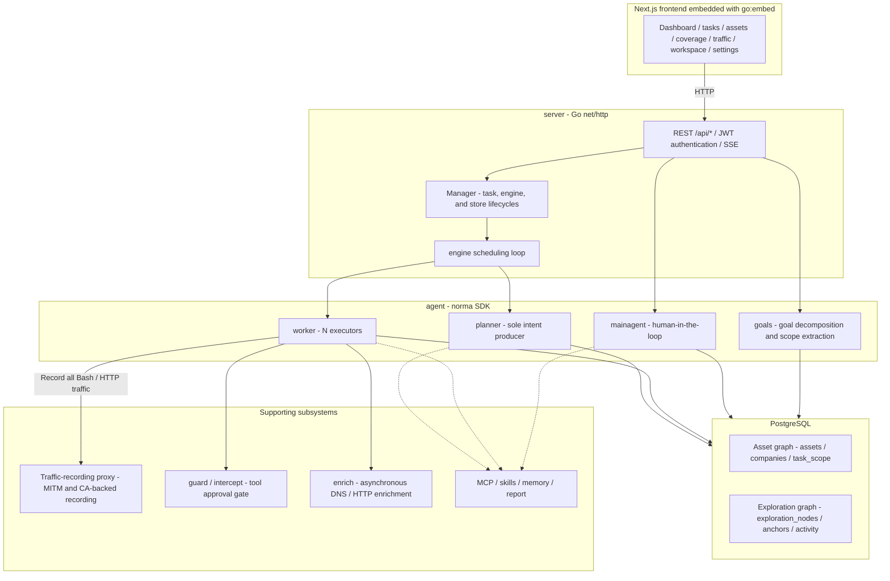
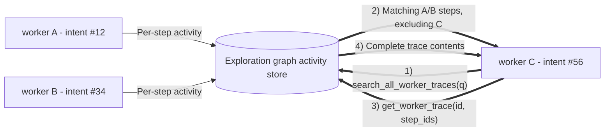
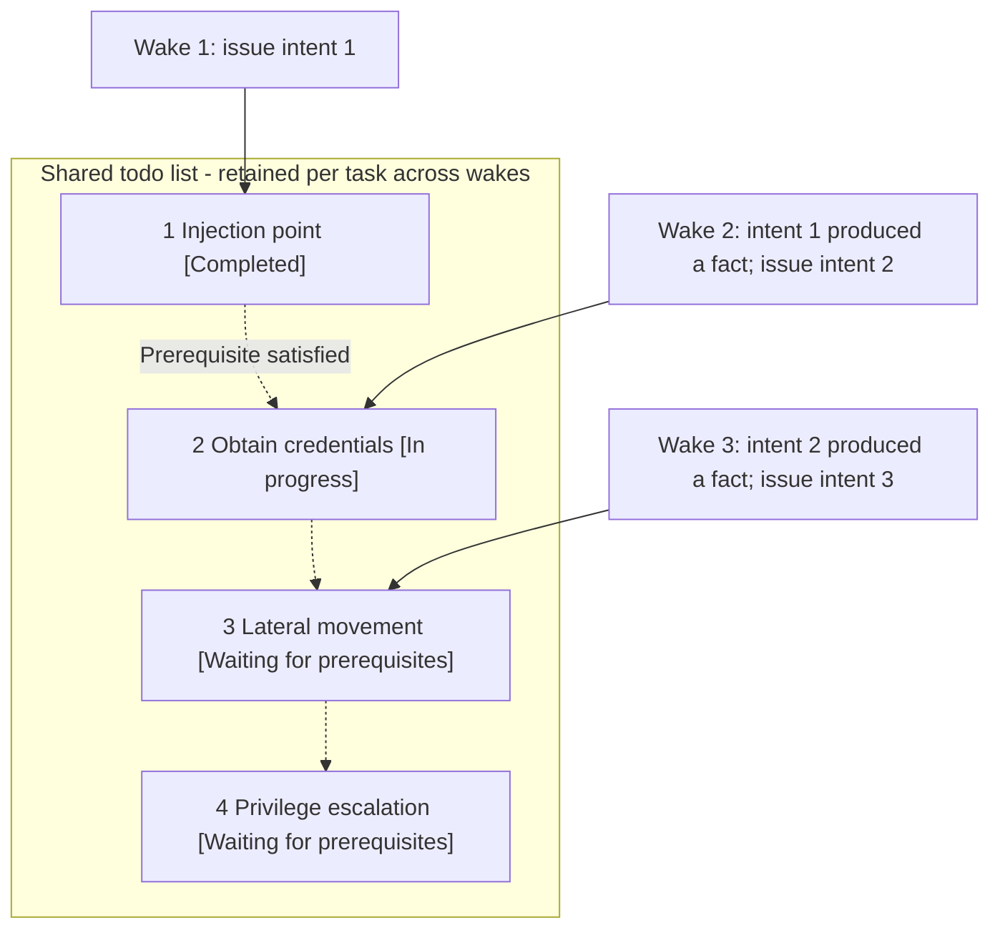

<div align="center">

# ARTEX

Autonomous AI penetration testing system (Go backend + Next.js frontend)

🌐 **Live demo**: [https://artex-demo.vercel.app/](https://artex-demo.vercel.app/)

</div>

## About this fork

This fork is maintained in English. Upstream attribution, repository links, and image names are preserved. `docker compose up` currently pulls the upstream `autumn27/artex` image, which has the Chinese UI; the fork owner will publish a separate English image. Screenshots below still show the Chinese UI until they are recaptured.

The in-app updater still downloads releases from `Autumn-27/artex` and replaces only the executable. Obtain the English build from a release published by this fork's owner; upstream releases do not contain this conversion. Refresh `skills/` manually when upgrading, because the in-app updater does not replace skill files.

---

## Screenshots

> Try the [live demo](https://artex-demo.vercel.app/) for the complete interaction.

| Dashboard (overview / token usage / activity feed) | Task list |
| :---: | :---: |
|  |  |

| Task execution trace (sessions / tool calls) | Exploration graph |
| :---: | :---: |
|  |  |

| Findings | Assets |
| :---: | :---: |
|  |  |

| Asset coverage map (force-directed layout, tested-asset highlighting, collapsible nodes) |
| :---: |
|  |

| Traffic recording | Human-in-the-loop conversations |
| :---: | :---: |
|  |  |

| Agent management | LLM configuration |
| :---: | :---: |
|  |  |

| Intercept approval | Backend logs |
| :---: | :---: |
|  |  |

---

## Approval record details

Global Approval records, task-level Intercept approval, and approval cards in conversations all expand to show details. The presentation draws on [AegisHook's approval detail component](https://github.com/RuoJi6/AegisHook/blob/main/web/src/components/CallDetail.vue) while using ARTEX components and themes.

## Asset synchronization (ScopeSentry)

Import assets directly from [ScopeSentry](https://github.com/Autumn-27/ScopeSentry) without collecting them again:

- Enter the ScopeSentry URL and API key on the **Asset synchronization** page to connect a data source.
- Select targets and asset types by **project** or **task**, including domains, subdomains, IPs, ports, sites, and endpoints.
- Import them in one step, merge them according to company asset scope, and make them available in ARTEX's asset graph for agent exploration.

---

## Installation

> **PostgreSQL** is required. Exploration also requires an **LLM**, configured through `ANTHROPIC_API_KEY`, `OPENAI_API_KEY`, or the UI.

### Option 1: installation script (recommended)

The upstream source URL is retained below; use this fork's checkout when building its English version.

```bash
git clone https://github.com/Autumn-27/ARTEX.git
cd ARTEX
./install.sh
```

The script detects or installs Docker, then offers **1) Docker deployment** or **2) build and run locally**:

- **Docker**: enter a Postgres password, or press Enter to generate one; the script writes `.env` and runs `docker compose up -d`.
- **Local**: select an existing database or start one in Docker; the script generates `config.json`, builds a single Go binary with the frontend embedded, and starts it.

Open **http://localhost:8787** after installation. The initial `/setup` page sets the administrator password.

### Option 2: Docker Compose (manual)

```bash
git clone https://github.com/Autumn-27/ARTEX.git
cd ARTEX
cp .env.example .env          # Set POSTGRES_PASSWORD and, optionally, ANTHROPIC_API_KEY.
docker compose up -d          # Pull autumn27/artex and postgres.
# Open http://localhost:8787.
```

The image includes common tools such as ripgrep, curl, vim, npm, and nmap. Bind mounts persist `./skills` and `./data`.

For remote MCP, select `http` (Streamable HTTP) or `sse` (legacy SSE) in System settings. Legacy SSE services typically open an event stream with `GET /sse`, then receive JSON-RPC requests through the returned `/message?sessionId=...` endpoint. Configure the URL as `/sse` and enter the header as `Authorization=Bearer <token>`.

### Option 3: prebuilt binaries (Releases)

Download the ZIP for your platform from [Releases](https://github.com/Autumn-27/ARTEX/releases). It contains `artex`, `start.sh` (`start.bat` on Windows), `skills/`, and `config.example.json`. For the English fork, obtain the corresponding release from the fork owner as described above.

```bash
cp config.example.json config.json   # Configure the database connection.
./start.sh                           # Open http://localhost:8787.
```

> Start with `start.sh` / `start.bat`. These supervisor scripts decide whether to restart after each exit; the [in-app updater](#option-1-in-app-update-recommended) relies on them to complete replacement. Running `./artex` directly will not restart it after an update.
>
> For background operation: `nohup ./start.sh >artex.log 2>&1 &`.

### Option 4: build a single binary from source

```bash
# 1) Export the frontend.
cd web && npm ci && npm run build:static && cd ..
# 2) Copy it to the embedded directory.
cp -r web/out server/webui/dist
# 3) Build; -tags embedui is required to include the frontend.
CGO_ENABLED=0 go build -tags embedui -o artex ./cmd/artex
./start.sh
```

### Option 5: build cross-platform release archives

`build.sh` builds and embeds the frontend, strips debugging information with the Go linker, and packages release files as ZIPs. Release mode defaults to Linux amd64/arm64, macOS amd64/arm64, and Windows amd64:

```bash
./build.sh --release
# Output: dist/artex-0.3.3-*.zip
```

UPX self-extracting binaries can be incompatible with some Linux kernels, virtualized environments, or security policies, so UPX is disabled by default. Override targets with `ARTEX_TARGETS`. If the target environment is compatible, explicitly pass `--upx` for additional compression:

```bash
ARTEX_TARGETS=linux/amd64,windows/amd64 ./build.sh --release
./build.sh --target linux/amd64 --upx
```

The separate `docker-compose.bench.yml` has been translated but is currently non-functional: this repository does not include its required `Dockerfile.bench` or `bench/.env`.

---

## Updates

> Upgrades replace the program while preserving the Postgres `pgdata` volume, `./data` (jwt.key, SQLite, and other files), and `./skills`. **Database migrations run automatically**: every `artex` startup reruns `schema.sql` idempotently, including `ADD COLUMN` and `CREATE INDEX IF NOT EXISTS`. Back up `./data` and the database before upgrading.

### English-default migration

Fresh installations seed English defaults. Existing installations upgrade only prompts, tool descriptions/schemas, and intercept rules still equal to frozen upstream defaults. Prompt comparisons use SHA-256 fingerprints; targeted short-text comparisons protect customized tool and rule values. New English migration flags make these upgrades run once. Matching prompts receive a new default version, retaining the old version in history; customized content remains unchanged and is logged once at startup. Existing built-in agent labels follow their normal automatic refresh behavior.

Use the prompt/tool **Reset to default** controls in the management UI when you want to replace a customized value with its English default. New intercept reasons use `[model]`; historical model prefixes, archived reasons, stored mention tokens, and customized judge prompt contracts remain readable. New mention tokens use the existing ASCII aliases: `finding`, `asset`, `company`, `api`, `ip`, `app`, `domain`, `subdomain`, and `service`.

Notification labels and default message text are now English. Review existing vulnerability-class include/exclude keywords, because newly generated findings use English classes. Webhook template field names remain unchanged, while values such as `.Title`, `.SeverityLabel`, and `.StatusLabel` become English.

### Option 1: in-app update (recommended)

On **System settings** (`/system/settings`), the **Version and updates** card checks for and installs releases without requiring a server login. Its release source remains the upstream repository, as described in About this fork.

Selecting Update downloads the package for the current platform, verifies the release's `SHA256SUMS`, smoke-tests the new binary with `-h`, stages it as `artex.new`, and exits. `start.sh` / `start.bat` restarts the process to complete replacement. The page waits for the new version and refreshes automatically.

- **Failed updates do not leave a broken program**: failed verification or smoke tests discard the staged file and retain the running version. If the new version fails to start three times consecutively, it automatically rolls back to `artex.old`; the failed binary remains as `artex.failed` for diagnosis.
- **Rollback remains available**: the previous binary is retained as `artex.old`, with a Roll back to previous version action. Database schema changes are not rolled back.
- **Updates interrupt running tasks** because they restart the process. Update while idle.
- **Development builds cannot update**: versions named `dev` or carrying a `git describe` suffix are excluded so a release cannot overwrite a local debugging build.
- **Docker in-app updates replace only the executable**. Tools such as playwright and nmap remain unchanged. Recreating the container with `docker compose up -d` restores the image's bundled version. To update the whole image, use `docker compose pull artex && docker compose up -d artex`.
- If GitHub requires a proxy, configure the **global proxy** on the same page. Downloads use it, accept only GitHub domains, and require HTTPS.
- The updater never replaces `skills/`; refresh that directory manually when installing the English build or updated skill definitions.

### Option 2: update script

```bash
cd ARTEX
./update.sh
```

The script optionally runs `git pull`, then offers **1) Docker update** or **2) local rebuild**, matching `install.sh`:

- **Docker**: optionally select an image tag; Enter keeps `ARTEX_TAG` from `.env`, defaulting to `latest`. It then runs `docker compose pull` and `docker compose up -d`; startup applies schema migrations.
- **Local**: rebuild frontend static assets and `./artex`, then restart the process to activate the new build.

### Option 3: Docker Compose (manual)

```bash
cd ARTEX
git pull                       # Optionally update Compose files and scripts.
# To select a version, set ARTEX_TAG=v0.2.0 in .env; otherwise latest is used.
docker compose pull artex
docker compose up -d artex     # Restart with the new image and migrate the schema.
docker image prune -f          # Optionally remove old images.
```

### Option 4: prebuilt binaries (Releases)

Download the new ZIP from [Releases](https://github.com/Autumn-27/ARTEX/releases), or the fork owner's release for the English version. Stop the old process and replace `artex` and `skills/`, preserving your `config.json` and `data/`, then restart:

```bash
cp -r <extracted-directory>/skills ./ && cp <extracted-directory>/artex ./
./start.sh
```

### Option 5: build from source

```bash
git pull
cd web && npm ci && npm run build:static && cd ..
cp -r web/out server/webui/dist
CGO_ENABLED=0 go build -tags embedui -o artex ./cmd/artex
# Restart ./start.sh.
```

---

## Configuration

**Database**: configure `config.json`, or override it with `ARTEX_PG_DSN`:

```json
{
  "database": {
    "host": "127.0.0.1", "port": 5432,
    "user": "artex", "password": "yourpass",
    "dbname": "artex", "sslmode": "disable"
  }
}
```

**LLM**: set `export ANTHROPIC_API_KEY=sk-...` or `OPENAI_API_KEY`, or use the LLM configuration page. Optional variables are `ARTEX_LLM_PROVIDER`, `ARTEX_LLM_MODEL`, `ARTEX_LLM_BASE_URL`, and `ARTEX_LLM_PROXY`.

**Concurrency**: configure the number of workers per task in System settings; the default is 3.

**Common arguments**: `./start.sh -addr :8787 -proxy :8788`. `-addr` serves the frontend and API; `-proxy` serves the traffic-recording proxy. The startup script passes arguments directly to `artex`.

---

## Development

### Manual finding retests

The Retest tab in task details provides paginated finding selection, previous verdicts and evidence, and manual retest actions. Starting a retest keeps the current tab open and displays a spinner with Retesting. A confirmed fix updates the finding status.

Select Retest from a finding row, or Start retest in the Finding retest section of its details. Optionally provide a fixed version, test conditions, or constraints. The system creates a separate retester agent session and keeps the current page open. Flat, task-grouped, and asset views all provide this entry point. During execution, the action shows a spinner and Retesting; open its session when needed. It returns to Retest after completion. Retesting does not restart the original scan task. Verdicts are Reproduced, Fixed, or Inconclusive, and each run's verdict, evidence, and session link appear in the finding details.

The backend seeds an editable Finding retest (`retester`) agent on first startup. Configure its prompt, LLM, execution budget, and tools in Agent management. It uses its assigned LLM, or the globally active configuration when none is assigned. A successfully completed retest with a Fixed verdict changes the finding status to Fixed. Running, failed, stopped, and other verdicts preserve the existing status. Original evidence and reports are always retained. Fixed can also be selected manually. A running retest for the same finding reuses the existing session; a new run can start after stopping, failure, or service restart.

Retest history is currently available through finding details and sessions. It is not yet included in report exports or task archives, and traffic packages are not associated automatically. Demo mode produces explicitly labeled mock records and never contacts real targets.

### Run and test locally

```bash
./dev.sh    # Backend :8787 + traffic proxy :8788 + Next.js :5173; open http://localhost:5173.
```

- Backend: `go run ./cmd/artex`; the frontend is embedded only with `-tags embedui`.
- Frontend: `cd web && npm run dev`; `/api` proxies to the backend with hot reload.
- Tests: `go test ./...`.
- Mock preview without a backend: `cd web && NEXT_PUBLIC_MOCK=1 npm run dev`.

---

## Architecture

ARTEX is an **autonomous penetration testing system driven by multiple LLM agents**: a Go monolith with an embedded Next.js frontend and PostgreSQL. The [`norma`](https://github.com/Autumn-27/norma) SDK provides `agentcore`, `tool`, `permission`, `harness`, `memory`, and `transcript`. Its **two-graph architecture** supports two autonomy mechanisms: **execution-trace information exchange between workers**, and a **planner todo list shared across rounds to advance attack chains reliably**.

### Layers



| Layer | Responsibilities |
| --- | --- |
| **Frontend** | Next.js static export embedded with `go:embed`; task, asset, exploration graph, and coverage visualization; human-in-the-loop conversations |
| **server** | `net/http` routing, JWT authentication, and SSE; `Manager` owns task, engine, and database-store lifecycles |
| **engine** | One `plannerLoop` and N worker goroutines per task; intent claiming, timeouts, pause, and drain |
| **agent** | goals / planner / worker / mainagent; `ToolSet` exposes both graphs as LLM tools |
| **db** | PostgreSQL persistence through pgx; embedded schema applies idempotently at every startup |
| **Supporting subsystems** | Recording MITM proxy, approval gates, asynchronous enrichment, MCP, skills, memory, and reports |

### Two graphs: exploration graph and asset graph

The system separates **what the goal is** from **how far exploration has progressed** into independent graphs connected through anchors:

- **Asset graph, shared globally**: a cross-task source of truth for assets. Nodes are `root_domain / subdomain / ip / service / app / endpoint`, owned by companies. The program computes domain -> subdomain -> service -> endpoint relationships and deduplication keys; agents submit raw information only.
- **Exploration graph, per task**: the task's reasoning and progress. Nodes are `goal / intent / fact / finding / hint`, connected by `spawns / derived_from / yields / proves` edges into a **lineage graph** showing which directions followed from which facts and what they produced.
- **Anchors connect them**: `exploration_anchors(node_id, asset_id)` associates intents, facts, and findings with concrete assets. A direction reveals which assets it targets; an asset reveals which intents tested it and which facts resulted. This also powers **asset test coverage** and the **asset coverage map**, combining in-scope assets with tested-asset highlighting.


> **Planner** reads the exploration graph, evaluates goals, and adds **intents** to the frontier only when a new uncovered direction exists. A **worker** claims **one intent**, executes real tools, writes new assets/facts/findings to the graphs, and stops. The asset graph holds shared facts; the exploration graph tracks each task's progress.

### Engine and intent lifecycle

The engine is an **event-driven** loop: graph changes wake the planner; the planner issues intents; workers claim and execute them; their writes trigger the next round, until goals are proven with `prove_goal`.

```mermaid
sequenceDiagram
  autonumber
  participant EV as Debounced graph changes
  participant P as planner
  participant FR as Frontier intent queue
  participant W as worker
  participant PX as Recording proxy
  participant DB as Both graphs and activity

  EV-->>P: Wake
  P->>DB: Read overview (prefetched graph_overview + coverage/scope)
  P->>FR: Issue 0..N intents with asset_ids
  Note over P,FR: Most wakes issue zero intents; stop when no new direction exists
  W->>FR: claimNext: claim one intent
  W->>DB: Load raw assets for the intent's asset_ids as initial context
  W->>PX: Execute real tools (Kali / Bash / HTTP)
  PX-->>W: Response with full recording and CA verification
  W->>DB: Write fact / asset / finding and per-step activity
  DB-->>EV: Graph change
  EV-->>P: Wake again
```

### Execution-trace exchange between workers

During deeper exploration, valuable observations such as errors, response fragments, and hidden parameters may appear in a worker's **execution trace** without becoming formal facts. To avoid repeated work and share those observations, workers can **search traces across work items**:

- `search_all_worker_traces(q)` searches **other work items in the current task**, automatically excluding the current intent's steps. Matches include `intent_id`.
- `list_worker_traces` / `get_worker_trace(intent_id, step_ids=[...])` list prior work and retrieve complete contents for selected steps.

Later workers can reuse observations even before a corresponding fact appears in the exploration graph. **Information flows between workers at execution-trace granularity**, while each worker remains limited to its claimed intent.



### Shared planner todo list across rounds

Real attack chains are often **sequences with prerequisites**, such as finding an injection point, obtaining credentials, moving laterally, and escalating privileges. Dispatching all steps in parallel would scramble those dependencies. The planner therefore maintains a **per-task planning todo list shared across wakes**:

- The planner wakes on graph changes, but **each wake starts a fresh session**. Its shared todo list records a serial exploitation chain **once**, then dispatches intents **in dependency order across rounds**, without expanding the entire chain into immediately actionable work.
- Each round dispatches only the next step whose prerequisites are complete and whose required facts already exist, then updates the list as facts satisfy completed steps.



Attack chains can thus **advance consistently without duplication or ordering errors**, even with event-driven, stateless sessions. This is central to ARTEX's autonomous execution of multistep chains.

---

## Upstream project and community

Scan the QR code to follow the **SecSentry** WeChat public account, then send it a private message to join the discussion group.

<div align="center">


</div>

---

## References

https://github.com/oritera/Cairn

## License and disclaimer

### Open-source license

This project is licensed under the **GNU Affero General Public License v3.0 (AGPL-3.0)**. See [LICENSE](LICENSE) for the complete terms.

Anyone may use, modify, and distribute the project, but **derivative works must also be released under AGPL-3.0**. In particular, **if you modify the project and provide it to users over a network, such as an online service, you must make the complete corresponding source code available to those users**.

> **Important:** the open-source license itself does not restrict the purposes for which the software is used. The usage restrictions and disclaimer below are additional conditions and statements made by the author; you must comply with them.

**ARTEX is intended only for personal learning, source-code research, and local technical validation. It must not be used to conduct real tests against any online system or website.**

### Permitted uses

- **Reading, learning from, and researching this project's source code**, and validating technical principles in a **local, isolated environment** only.
- Non-offensive uses such as personal learning, academic research, and code review.

### Prohibited uses

- **Using this tool to scan, probe, exploit, or attack any website, online service, or network-connected system is strictly prohibited**, regardless of authorization or asset ownership.
- Do not use this tool for actual penetration testing, attack/defense exercises, or production environments.
- Do not use it for unauthorized access, data theft, extortion, denial of service, or any destructive or criminal activity.
- Do not use it in violation of the laws or regulations of your country or region.

### Compliance responsibility

Users are responsible for complying with all applicable cybersecurity, data-protection, and computer-crime laws and regulations. In mainland China, these include the Cybersecurity Law, Data Security Law, Personal Information Protection Law, and relevant judicial interpretations. **Users bear all legal responsibility and consequences arising from their use of this tool.**

### Disclaimer

This project is provided **AS IS**, without any express or implied warranty. The author and contributors are not liable for direct or indirect losses, data loss, system damage, or legal disputes arising from its use, whether proper or improper. **Downloading, installing, or using this project signifies that you have read, understood, and accepted all terms above.**
