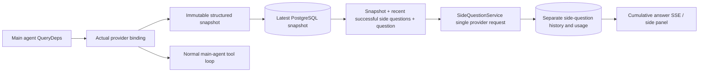

# ARTEX `/btw`

Ordinary conversations, a task's MainAgent, and workers belonging to the current task support independent side questions. Enter `/btw question` in the main input to submit one. An empty `/btw` or the Side question button opens history. Desktop uses a resizable sidebar; mobile uses a Drawer.

Answers use an agent-context snapshot captured at submission and support streaming, follow-up questions, stopping, and clearing. Closing the panel, refreshing, or disconnecting SSE does not cancel the model request. Stopping affects only the current side question. Clearing cancels side questions and deletes their history while retaining the main context snapshot.

## Implementation boundaries

The feature uses Go, norma v0.3.7, Next.js, and existing Markdown / ResizablePanel / Drawer / AlertDialog components. It neither changes norma source nor adds side-question dependencies. Planner support, workers inherited from other tasks, and tool-based subtask upgrades are outside this change's scope.

- `capture.go` marks main-loop requests only in `Options.Deps.CallModel / CallModelSync`. The provider decorator is inside the concrete model, after routing-pool selection, so it records the model actually selected. Compaction and summary requests do not replace snapshots.
- Snapshots are published at request start, after a complete model response, and at terminal run states. Partial responses are not published. norma's `MessagesForAPI` preserves tool-call/result pairing; results enter the snapshot on the next main-model request or terminal state. An interrupted stream retains the previous valid boundary.
- JSON deep copies preserve structured messages, system prompts, tool definitions, and generation parameters. Model inference holds neither the snapshot lock nor a database transaction.
- `SideQuestionService` calls a concrete provider. It first summarizes side-question history when needed. The final answer can retry once after reducing context only if the first context-overflow error occurs before any text or tool calls are emitted. It creates no agent session and does not enter the tool executor, main transcript, activity feed, task graph, or task model-switching chain. Answer requests retain tool definitions for compatibility with existing structured tool context; summary requests have no tools. Newly returned tool calls have no execution path.
- Each parent session permits one active request, with at most four per service process and a 120-second timeout. Side questions use independent cancellation contexts tied to the service lifecycle.
- Requests retain a model-configuration reference and a non-sensitive identity summary; credentials are obtained from existing configuration when needed. If a profile is deleted or identity fields such as model, protocol, or address change, the main agent must run again to refresh the snapshot. Tests do not alter the product's default model.

## Persistence and recovery

`db/schema.sql` creates `side_question_sessions` and `side_question_requests` automatically. Sessions store parent resources, the latest snapshot, run ID, version, and clear generation. Requests store questions, cumulative answers, status, model, snapshot time, usage, event sequence, and pagination ordinal.

Parent-session keys use a conversation ID, or task ID + exploration ID + intent ID. Workers do not use reusable execution-slot names.

Snapshots are coalesced by parent session and flushed every 250 ms. The database compares `(run_id, version)` to reject stale writes. The selected snapshot is saved again before side-question admission. Successful writes release the large in-memory snapshot; failed writes retain the pending version. Cumulative answers are saved at most once per 250 ms during streaming. Terminal states are saved immediately, with bounded retries for database errors.

On startup, leftover `running` requests become `interrupted`, retaining persisted partial answers and usage without replaying requests. The latest saved context can answer the next question directly. Legacy sessions without snapshots must first run the main agent; context is not reconstructed from UI activity logs.

Clearing increments the clear generation and deletes requests; conditional updates prevent late callbacks from recreating data. Physical parent deletion uses foreign-key cascades. Worker logical deletion removes side-question data in the same transaction and rejects late snapshots. Task archiving blocks new requests, waits for the main flow to stop, then cancels side questions and waits for persistence. Archive format v3 also restores v1/v2 archives without side-question tables.

Complete history is retained, with ordinal cursors returning at most 20 entries per page. Model requests replay at most the latest 20 successful question/answer pairs, further bounded by a token budget. Older pairs form a separate rolling summary. If the main context exceeds budget, only the old portion of its side-question copy is summarized; recent structured tool calls and results remain paired. Summarization, preparation progress, and usage share side-question concurrency, cancellation, and the 120-second timeout. See [Context budgets and open-source references](CONTEXT_BUDGET.md).

## HTTP contract

The following paths serve as `{parent}`, retaining existing authentication and resource validation:

- `/api/conversations/{id}`
- `/api/tasks/{id}/chat`
- `/api/tasks/{id}/intents/{iid}`

| Request | Response and behavior |
| --- | --- |
| `GET {parent}/side-questions?before={ordinal}` | `items` newest first, independent `current` state, `snapshot` metadata, and `next_cursor`; cursor 0 means newest page / no next page |
| `POST {parent}/side-questions` | JSON `{ "question": "...", "client_request_id": "UUID" }`; new requests return 202 and a request object; the same ID and question return the existing object with 200 |
| `DELETE {parent}/side-questions` | Cancel and clear side questions for the current parent |
| `GET /api/side-questions/{requestID}/events` | `snapshot` SSE events with increasing sequence `id` and the complete cumulative request object as `data`; clearing sends `cleared` |
| `POST /api/side-questions/{requestID}/cancel` | Explicit cancellation; read the terminal state from history or SSE |

Questions are limited to 4000 characters. Missing snapshots, changed model configuration, a busy parent, or conflicting idempotency IDs return 409; the global concurrency limit returns 429. Every SSE connection starts with cumulative state and does not depend on previously received fragments. The frontend merges by request ID and sequence, discarding old callbacks when switching parents or clearing.

## Validation and references

See [VALIDATION.md](VALIDATION.md) for automated checks, real-model usage, and known limitations.

Independent requests draw on [Grok CLI side-question.ts at a pinned commit](https://github.com/superagent-ai/grok-cli/blob/fb97af83f06dca873281d60168430f06c8de6324/src/utils/side-question.ts); execution isolation draws on [OpenCode at a pinned commit](https://github.com/anomalyco/opencode/tree/b3f1a96c6dd7adeb28b36dd11add1998fc84d67b). ARTEX uses norma's structured messages instead of assembling context from frontend logs.
