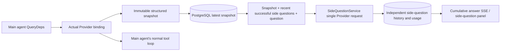

# ARTEX `/btw`

Ordinary chat, a task's MainAgent, and the current task's own Worker all support independent side questions. Type `/btw question` in the main input box to submit; an empty `/btw` or the "Side question" button opens the history. The desktop uses a resizable side panel; mobile uses a Drawer.

Side-question answers are generated from a snapshot of the agent's context at submit time, with streaming display, follow-ups, stop, and clear. Closing the panel, refreshing the page, or dropping the SSE connection does not cancel the model request. Stop affects only the current side question; clear cancels the side question and deletes the side-question history while keeping the main context snapshot.

## Implementation boundaries

Reuses Go, norma v0.3.7, Next.js, and the existing Markdown / ResizablePanel / Drawer / AlertDialog components; it does not modify norma's source or add dependencies for side questions. The Planner, Workers inherited from other tasks, and tool-type sub-task escalation are out of scope here.

- `capture.go` marks main-loop requests only at `Options.Deps.CallModel / CallModelSync`. The Provider decorator sits inside the concrete model, after the routing pool's outer selection, so it records the model actually chosen; compression and summary requests do not overwrite the snapshot.
- A snapshot is published at request start, at a complete model reply, and at a run's terminal state. A half-generated reply still in progress is not published; tool calls stay paired via norma's `MessagesForAPI`, and tool results enter the snapshot at the next main-model request or at the run's terminal state. A streaming abort keeps the last valid boundary.
- The snapshot preserves structured messages, the system prompt, tool definitions, and generation parameters through a JSON deep copy. Model inference holds no snapshot lock or database transaction.
- `SideQuestionService` calls the concrete Provider; when needed it first generates a side-question summary, and the final answer is allowed to shrink and retry once only when the context first exceeds the limit and no text/tool call has been output yet. It creates no agent session and does not connect to the tool executor, the main transcript, the activity stream, or the task graph, nor does it go through the task model-switch chain. The answer keeps tool definitions to stay compatible with the existing structured tool context; the summary request provides no tools. A newly returned tool call has no execution path.
- One running request per parent conversation, at most four per service process, with a 120-second per-request timeout. Side questions use an independent cancellation context under the service lifetime.
- A side-question request keeps a reference to the model configuration and a non-sensitive identity summary; credentials are fetched from the current configuration at request time. If the configuration is deleted, or identity fields such as model, protocol, or address change, it requires running the main agent first to refresh the snapshot. Tests do not change the product's default model.

## Persistence and recovery

`db/schema.sql` automatically creates `side_question_sessions` and `side_question_requests`. The former stores the parent resource, the latest snapshot, the run number, the version, and the cleanup version; the latter stores the question, the cumulative answer, status, model, snapshot time, usage, the event sequence number, and the pagination sequence number.

The parent-conversation key uses the conversation ID, or task ID + exploration ID + intent ID. Workers do not use reusable execution-slot naming.

Snapshots are written coalesced per parent conversation, flushed at most every 250 ms, and the database compares `(run_id, version)` to prevent an older version from overwriting a newer one. The selected snapshot is saved again before a side question is submitted. After a successful save the large in-memory snapshot is released; on failure the pending version is kept. The cumulative answer content is written at most every 250 ms as streaming events arrive, and the terminal state is saved immediately with limited retries on a database error.

On service startup, leftover `running` requests are marked `interrupted`, keeping the partial answer and usage already persisted, without replaying the request automatically. The most recently saved context can be used directly for the next question. When an old conversation has no snapshot, it requires running the main agent first and does not rebuild the context from the UI activity log.

A clear operation increments the cleanup version and deletes the requests; a conditional update blocks a late callback from writing back. Physical deletion of a parent resource relies on foreign-key cascade; a Worker logical-delete removes side-question data in the same transaction and rejects any later late snapshot. Task archiving first blocks new requests, waits for the main flow to stop, then cancels and waits for side questions to be persisted; the archive format is v3 and remains compatible with v1/v2, which have no side-question tables.

History is kept in full and returned by an ordinal cursor, at most 20 per page. A model request replays the original text of at most the 20 most recent successful exchanges, while also capping the replay amount by token budget; older exchanges maintain an independent rolling summary. When the main context exceeds budget, only the older part of the side-question copy is summarized, keeping recent structured tool calls and results. The summary, preparation progress, and usage are all subject to the side question's concurrency, cancellation, and 120-second timeout limits. See [Context budget and open-source references](CONTEXT_BUDGET.md) for details.

## HTTP contract

The following paths serve as `{parent}`, reusing the existing authentication and resource validation:

- `/api/conversations/{id}`
- `/api/tasks/{id}/chat`
- `/api/tasks/{id}/intents/{iid}`

| Request | Response and behavior |
| --- | --- |
| `GET {parent}/side-questions?before={ordinal}` | `items` ordered newest to oldest, an independent `current` run status, `snapshot` metadata, `next_cursor`; a cursor of 0 means the latest page / no next page |
| `POST {parent}/side-questions` | JSON `{ "question": "…", "client_request_id": "UUID" }`; a new request returns 202 and the request object; the same ID and question returns the existing object with 200 |
| `DELETE {parent}/side-questions` | cancels and clears the current parent conversation's side questions |
| `GET /api/side-questions/{requestID}/events` | `snapshot` SSE events, with `id` as an increasing sequence number and `data` as the full cumulative request object; sends `cleared` on clear |
| `POST /api/side-questions/{requestID}/cancel` | explicit cancel; the terminal state can be read from history or SSE |

The question limit is 4000 characters. No snapshot, a changed model configuration, the same parent conversation being busy, or an idempotency-ID conflict returns 409; hitting the global concurrency limit returns 429. Every SSE connection sends the cumulative state first and does not rely on text fragments the client received earlier. The frontend merges by request ID + sequence number and discards old callbacks when switching parent conversations or on clear.

## Validation and references

See [VALIDATION.md](VALIDATION.md) for automated checks, actual model usage, and known limitations.

The independent-request design references [Grok CLI side-question.ts (pinned commit)](https://github.com/superagent-ai/grok-cli/blob/fb97af83f06dca873281d60168430f06c8de6324/src/utils/side-question.ts), and run isolation references [OpenCode (pinned commit)](https://github.com/anomalyco/opencode/tree/b3f1a96c6dd7adeb28b36dd11add1998fc84d67b). ARTEX's context uses norma's structured messages rather than stitching text from frontend logs.
