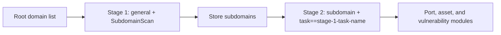

---

## name: scopesentry-mcp
description: Manage a security scanning platform through ScopeSentry MCP, including projects, tasks, templates, assets, and nodes. Use when the user mentions ScopeSentry, MCP, API keys, scan tasks, or asset queries.

# ScopeSentry MCP guide

For users with an **existing ScopeSentry deployment**. Connect through Cursor or another MCP client; no local source checkout is required.

## 1. Prerequisites

### 1.1 Verify service access

- Default web interface: `http://<host>`
- MCP endpoint: `http://<host>/mcp`. If a reverse proxy or frontend proxy is present, use the actual `/mcp` URL.

### 1.2 Create an API key

1. Sign in to the ScopeSentry web interface.
2. Create a key on the **API Key** management page or through an administrator-provided endpoint.
3. Save the returned `ssk_...` value; **it is shown only once**.

### 1.3 Configure Cursor MCP

In Cursor, open Settings -> MCP -> Add server:

```json
{
  "mcpServers": {
    "scopesentry": {
      "url": "http://<your-host>:8082/mcp",
      "headers": {
        "X-API-Key": "ssk_your_key"
      }
    }
  }
}
```

Alternatively, use `Authorization: Bearer ssk_your_key`.

Restart MCP or reload Cursor after configuration. Verify that tools such as `list_projects` and `list_assets` appear.

---

## 2. Tools

| Tool | Purpose |
| --- | --- |
| `list_projects` | Project tree grouped by tag, including project IDs |
| `list_projects_data` | Paginated projects with name search |
| `get_project` | Project details |
| `create_project` | Create a project |
| `list_tasks` | List scan tasks |
| `get_task` | Task details |
| `list_scan_templates` | List scan templates |
| `get_scan_template` | Template details |
| `list_plugin_modules` | Scan pipeline module names |
| `list_plugins` | Available plugins, including hashes and default parameters |
| `create_scan_template` | Create a scan template |
| `create_scan_task` | Create a scan task |
| `list_assets` | Query asset types with pagination |
| `count_assets` | Count assets through `/api/assets/common/total` |
| `get_asset_detail` | Asset or vulnerability details |
| `add_asset_tag` | Add a tag to an asset |
| `list_nodes` | List scanning nodes |

The MCP tool descriptions and schemas define the parameters. `list_assets` and `count_assets` share search/filter syntax; read the `list_assets` description before querying assets when needed.

Use `count_assets` for totals, corresponding to the web pagination-total endpoint. Do not repeatedly paginate `list_assets` just to count records.

---

## 3. Common workflows

### 3.1 Query assets by project

When the user or context **already specifies a project**, prefer `filter.project` to narrow the query and avoid slow responses caused by excessive cross-project data. A project filter is not mandatory when no project is specified.

1. Use `list_projects` or `list_projects_data` to obtain the target project's **ObjectID** (`id` / `children[].value`).
2. Pass that ID in `filter.project` to `list_assets`. **Use the ID, never the project's display name.**

```json
{
  "asset_type": "asset",
  "pageIndex": 1,
  "pageSize": 20,
  "search": "domain=^example.com",
  "filter": {
    "project": ["<projectObjectID>"]
  }
}
```

### 3.2 Create a scan task

1. Use `list_nodes` to obtain online node names.
2. Use `list_scan_templates` or `create_scan_template` to obtain a template **ObjectID**.
3. Call `create_scan_task`: `name` and `node` are required; `template` takes a template ID, not its name.

**Target sources (`targetSource`), matching the web interface:**

| targetSource | Meaning | Required parameters |
| --- | --- | --- |
| `general` | Targets entered directly | `target` |
| `project` | Targets from projects | `project`, an array of project ObjectIDs |
| `asset` | Search the web asset inventory | `search`; optional `project`, `filter`, `targetNumber` |
| `RootDomain` | Search the root-domain inventory | `search`; optional `project`, `filter`, `targetNumber` |
| `subdomain` | Search the subdomain inventory | `search`; optional `project`, `filter`, `targetNumber` |
| `UrlScan` | Search URL scan results | `search`; optional `project`, `filter`, `targetNumber` |
| `*Source`, such as `subdomainSource` | Create from selected/search results on an asset page | For `targetTp=search`, use `search`; for `targetTp=select`, use `targetIds` |

**Example: scan root domains directly:**

```json
{
  "name": "example-subdomain-discovery",
  "node": ["node-1"],
  "template": "<templateObjectID>",
  "targetSource": "general",
  "target": "example.com\nfoo.com",
  "project": ["<projectObjectID>"]
}
```

**Example: continue from subdomains, filtering by the previous task's name:**

```json
{
  "name": "example-ports-and-vulnerabilities",
  "node": ["node-1"],
  "template": "<followupTemplateObjectID>",
  "targetSource": "subdomain",
  "search": "task==\"example-subdomain-discovery\"",
  "project": ["<projectObjectID>"]
}
```

### 3.3 Complete root-domain reconnaissance (two stages recommended)

For **root-domain** input requiring **complete reconnaissance**, run two scans rather than the entire pipeline in one pass.

**Why:** distributed tasks are dispatched per **individual target**. When a node receives a root domain, subdomains discovered there continue through subsequent modules on that same node. This can create uneven load, slower execution, and more errors.

**Recommended workflow:**

1. **Stage 1: subdomain discovery only**
   - `targetSource`: `general`.
   - `target`: all root domains, one per line.
   - Template: enable only `SubdomainScan` and `SubdomainSecurity`, for subdomain scanning and takeover checks.
   - Wait for completion using `get_task`.
2. **Stage 2: subsequent modules**
   - `targetSource`: `subdomain`.
   - `search`: `task=="<stage-1-task-name>"`, matching the task name exactly.
   - Optionally narrow the scope with `project`.
   - Template: port scanning, asset mapping, vulnerability scanning, and other needed modules; `SubdomainScan` can be omitted.
   - Subdomains are dispatched as independent targets across nodes for better parallelism.

The equivalent web workflow is to filter the Subdomains asset page by task name and choose Create task from subdomains.



### 3.4 Create a scan template

1. `list_plugin_modules` returns module names.
2. `list_plugins`, optionally filtered by `module`, returns each plugin's `hash` and default `parameter`.
3. Call `create_scan_template` with `modules` mapping module names to arrays of plugin hashes.

---

## 4. Asset queries (`list_assets` / `count_assets`)

`count_assets` accepts the same `asset_type`, `search`, and `filter` as `list_assets`. It returns `{ "total": N }`, corresponding to `/api/assets/common/total` in the web interface.

```json
{
  "asset_type": "subdomain",
  "search": "task==\"example-task\"",
  "filter": {"project": ["<projectObjectID>"]}
}
```

**Performance guidance for both tools:** when a project is specified, prefer `filter.project`. For indexed fields in `search`, prefer exact equality `==` or prefix matching `^`; see [4.3](#43-search-expressions). Avoid broad `=` fuzzy matches that slow responses. Do not require a project filter when no project context exists.

Asset types supporting `filter.project` are listed in [4.4](#44-exact-filters).

### 4.1 Asset types (`asset_type`)

`asset`, `RootDomain`, `subdomain`, `app`, `mp`, `UrlScan`, `SensitiveResult`, `DirScanResult`, `crawler`, `vulnerability`, `PageMonitoring`, `IPAsset`, `SubdomainTakerResult`

Example aliases: `web` -> asset, `vuln` -> vulnerability, `ip` -> IPAsset, `url` -> UrlScan.

### 4.2 Parameters

| Parameter | Meaning |
| --- | --- |
| `pageIndex` / `pageSize` | Pagination, default 1 / 20 |
| `search` | Search expression; see below |
| `filter` | Exact-filter JSON; see below |
| `sort` | Sorting by `length`, supported only by UrlScan and DirScanResult |
| `sid` | SensitiveResult only: sensitive-rule name |

`search` and `filter` **can be combined**.

### 4.3 Search expressions

This is a custom DSL, **not SQL**:

| Operator | Meaning | Index use | Example |
| --- | --- | --- | --- |
| `=` | Fuzzy match (regex) | No | `domain=example` |
| `==` | Exact equality | **Yes** | `port==443` |
| `!=` | Exclude | - | `port!="80"` |
| `&&` | AND | - | `domain==example.com && port==443` |
| `||` | OR | - | `title=admin || body=login` |

**Indexes and operators:** fields such as `domain`, `ip`, `port`, and `title` are indexed, but only **exact equality `==`** or **prefix matching with a value beginning with `^`**, such as `domain=^example.com`, can use those indexes. **`=` becomes a fuzzy regex match and cannot use an index**, which can be slow on large datasets.

**Search fields shared by all types:** `tag`, `task` (task name), `rootDomain`.

**Do not put project in search**; it is ineffective or causes errors when combined with `&&`. Use `filter.project`.

**Common search fields by type:**

| asset_type | Fields |
| --- | --- |
| asset | domain, ip, port, service, app, title, statuscode, icon, banner, type, body, header |
| RootDomain | domain, icp, company |
| subdomain | domain, ip, type, value |
| app | name, icp, company, category, description, url, apk |
| mp | name, icp, company, category, description, url |
| UrlScan | url, input, source, resultId, type |
| SensitiveResult | url, sname, body, info, md5 |
| DirScanResult | url, statuscode, redirect, length |
| vulnerability | url, vulname, matched, request, response, level |
| crawler | url, method, body, resultId |
| PageMonitoring | url, hash, diff, response |
| IPAsset | ip, domain, port, service, webServer, app |
| SubdomainTakerResult | domain, value, type, response |

**Search examples:**

- `domain==www.example.com && port==443`: exact equality, indexed.
- `domain=^example.com`: prefix match, indexed.
- `ip==192.168.1.1`.
- `task=="example-task"`.
- `level==high` for vulnerability.
- `statuscode==200` for DirScanResult.

Use `=` only when a fuzzy substring match is needed, such as `title=admin`. It does not use an index; combine it with project or other scope constraints where practical.

### 4.4 Exact filters

A JSON object: values under the same key are combined with **OR**; different keys are combined with **AND**.

**Prefer `project` when a project is specified:** if the user or context identifies a project and asset_type supports it, include the filter to narrow the query. It is not mandatory without project information.

| Filter key | Meaning | Values |
| --- | --- | --- |
| `project` | Owning project | **ObjectID** from `list_projects` / `list_projects_data` |
| `task` | Source task | **Task name** from `list_tasks`'s `name` |
| `port` | Port | For example, `"443"` |
| `service` | Service/protocol | For example, `"https"` |
| `app` | Application fingerprint | For example, `"Nginx"` |
| `icon` | Icon hash | |
| `statuscode` | HTTP status code | Primarily asset |
| `status` | Status | UrlScan/DirScan HTTP code; vulnerability/sensitive-information processing status |
| `level` | Vulnerability severity | critical / high / medium / low / info |
| `type` | Type | For example, subdomain record type A or CNAME |
| `color` | Sensitive-rule color | SensitiveResult |
| `sname` | Sensitive-rule name | SensitiveResult |
| `tags` | Tags | |

**Supported filter keys by asset type:**

| asset_type | Filter keys |
| --- | --- |
| asset | project, port, service, app, icon, statuscode, type, task, tags |
| RootDomain | project, tags |
| subdomain | project, type, task, tags |
| app / mp | project, tags |
| UrlScan | status, tags |
| DirScanResult | status, tags |
| SensitiveResult | status, color, sname, tags |
| crawler | project, task, tags |
| vulnerability | project, level, status, task, tags |
| PageMonitoring / SubdomainTakerResult | tags |
| IPAsset | project, port, service, app |

**Filter example:**

```json
{"project": ["<projectObjectID>"], "port": ["443"]}
```

**Combined query example:**

```json
{
  "asset_type": "asset",
  "search": "domain=^baidu && port==443",
  "filter": {"project": ["<projectObjectID>"]},
  "pageIndex": 1,
  "pageSize": 10
}
```

**Notes:**

- Prefer `filter.project` when project context exists and the type supports it; otherwise it is optional.
- Do not pass the project's display name in `filter.project`.
- Use `==` for known values and `^` for prefixes; avoid excessive fuzzy `=` queries on large tables.
- For UrlScan HTTP status, use `filter.status`; DirScanResult supports `statuscode==200` in search.
- For SensitiveResult rule names, use `sname=rule-name` in `search` or `filter.sname`.

### 4.5 Sorting (`sort`)

Supported only by **UrlScan** and **DirScanResult**:

```json
{"length": "ascending"}
```

Other types ignore `sort` and use their default time ordering.

---

## 5. Scan template module names

`TargetHandler`, `SubdomainScan`, `SubdomainSecurity`, `PortScanPreparation`, `PortScan`, `PortFingerprint`, `AssetMapping`, `AssetHandle`, `URLScan`, `WebCrawler`, `URLSecurity`, `DirScan`, `VulnerabilityScan`, `PassiveScan`

---

## 6. Troubleshooting

| Symptom | Action |
| --- | --- |
| No MCP tools | Check the URL, API key, and whether ScopeSentry is running |
| 401 / 403 | Recreate or replace the API key |
| Assets not found | Verify that `filter.project` is an ObjectID; do not put project in search |
| Template/task creation fails | `template` must be a template ObjectID; `node` must contain online node names |
| Queries are slow or stall | Use `filter.project` when a project is known; prefer `==` or `^` prefixes on indexed search fields over `=`; reduce `pageSize` |

---
