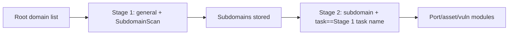

---

## name: scopesentry-mcp
description: Manage a security scanning platform (projects, tasks, templates, assets, nodes) through the ScopeSentry MCP. Use when the user mentions ScopeSentry, MCP, API Key, scan tasks, or asset queries.

# ScopeSentry MCP usage guide

For users with a **deployed ScopeSentry instance**. Connect to the platform through Cursor (or another MCP client); no local source code is needed.

## 1. Preparation

### 1.1 Confirm the service is reachable

- Default web UI: `http://<host>`
- MCP endpoint: `http://<host>/mcp` (if there is a reverse proxy or frontend proxy in front, use the actual `/mcp` address)

### 1.2 Create an API Key

1. Log in to the ScopeSentry web UI in a browser
2. Go to the **API Key** management page and create a key (or create one through an interface provided by the administrator)
3. Save the returned `ssk_...` string (**shown only once**)

### 1.3 Configure Cursor MCP

Cursor → Settings → MCP → add a server:

```json
{
  "mcpServers": {
    "scopesentry": {
      "url": "http://<your-host>:8082/mcp",
      "headers": {
        "X-API-Key": "ssk_your-key"
      }
    }
  }
}
```

You can also use: `Authorization: Bearer ssk_your-key`

After configuring, restart MCP or reload Cursor and confirm that `list_projects`, `list_assets`, etc. appear in the tool list.

---

## 2. Tool overview


| Tool                   | Purpose             |
| ---------------------- | ----------------- |
| `list_projects`        | Project tree grouped by tag (incl. project ID) |
| `list_projects_data`   | Paginated project list, searchable by name |
| `get_project`          | Project details |
| `create_project`       | Create a project |
| `list_tasks`           | Scan task list |
| `get_task`             | Task details |
| `list_scan_templates`  | Scan template list |
| `get_scan_template`    | Template details |
| `list_plugin_modules`  | Scan pipeline module names |
| `list_plugins`         | Available plugins (incl. hash, default parameters) |
| `create_scan_template` | Create a scan template |
| `create_scan_task`     | Create a scan task |
| `list_assets`          | Query assets of every kind (paginated list) |
| `count_assets`         | Count assets (`/api/assets/common/total`) |
| `get_asset_detail`     | Asset or vulnerability details |
| `add_asset_tag`        | Add a tag to an asset |
| `list_nodes`           | Scan node list |


Each tool's parameters are defined by its MCP tool description (schema); `list_assets` / `count_assets` share the same search and filter syntax, so read the `list_assets` description before querying assets.

When you need to know "how many in total", use `count_assets` (it maps to the web pagination-total endpoint); do not page through `list_assets` repeatedly just to count.

---

## 3. Common workflows

### 3.1 Query assets by project

When the user or context **already has a project condition**, prefer passing `filter.project` to narrow the scope and avoid slow responses from too much cross-project data. If there is no explicit project, the project filter is not required.

1. `list_projects` or `list_projects_data` to get the target project's **ObjectID** (`id` / `children[].value`)
2. `list_assets` with `filter.project` (**must be the ID, not the project's display name**)

```json
{
  "asset_type": "asset",
  "pageIndex": 1,
  "pageSize": 20,
  "search": "domain=^example.com",
  "filter": {
    "project": ["<project ObjectID>"]
  }
}
```

### 3.2 Create a scan task

1. `list_nodes` to get online node names
2. `list_scan_templates` or `create_scan_template` to get the template **ObjectID**
3. `create_scan_task`: `name` and `node` are required, `template` takes the template ID (not the template name)

**Target source `targetSource` (same as the web UI):**

| targetSource | Description | Required parameters |
| --- | --- | --- |
| `general` | Enter targets directly | `target` |
| `project` | Read targets from a project | `project` (array of project ObjectIDs) |
| `asset` | Search the web asset store | `search`; optional `project`, `filter`, `targetNumber` |
| `RootDomain` | Search the root-domain store | `search`; optional `project`, `filter`, `targetNumber` |
| `subdomain` | Search the subdomain store | `search`; optional `project`, `filter`, `targetNumber` |
| `UrlScan` | Search URL scan results | `search`; optional `project`, `filter`, `targetNumber` |
| `*Source` (e.g. `subdomainSource`) | Create from "select/search" on the asset page | with `targetTp=search` use `search`; with `targetTp=select` use `targetIds` |

**Example — scan root domains directly:**

```json
{
  "name": "example-subdomain-collection",
  "node": ["node-1"],
  "template": "<template ObjectID>",
  "targetSource": "general",
  "target": "example.com\nfoo.com",
  "project": ["<project ObjectID>"]
}
```

**Example — continue scanning from the subdomain store (filter by the previous task name):**

```json
{
  "name": "example-ports-and-vulns",
  "node": ["node-1"],
  "template": "<follow-up-modules template ObjectID>",
  "targetSource": "subdomain",
  "search": "task==\"example-subdomain-collection\"",
  "project": ["<project ObjectID>"]
}
```

### 3.3 Full root-domain information gathering (two-stage recommended)

When the input is a **root domain** and you want **full information gathering**, run two scans rather than the whole pipeline at once.

**Why:** distributed tasks are dispatched per **single target**. When a root domain is the target, the node that gets it will also run the later modules on that node for every subdomain it discovers there, which easily causes uneven load, slowness, and errors.

**Best practice:**

1. **Stage 1 — subdomain collection only**
   - `targetSource`: `general`
   - `target`: all root domains (multi-line)
   - Template: enable only `SubdomainScan`, `SubdomainSecurity` (subdomain scan + subdomain takeover)
   - Use `get_task` to wait for the task to finish

2. **Stage 2 — later modules**
   - `targetSource`: `subdomain`
   - `search`: `task=="<Stage 1 task name>"` (exact match on the task name)
   - Optional `project` to narrow the scope
   - Template: port scan, asset mapping, vulnerability scan, etc. (need not include SubdomainScan)
   - Subdomains are dispatched to nodes as independent targets, for better parallel efficiency

You can also, on the "subdomain" asset page in the web UI, filter by task name and use "create task from subdomains" for the same effect.



### 3.4 Create a scan template

1. `list_plugin_modules` → list of module names
2. `list_plugins` (filterable by `module`) → each plugin's `hash` and default `parameter`
3. `create_scan_template`: use `modules` to specify "module → array of plugin hashes"

---

## 4. Asset queries (`list_assets` / `count_assets`)

`count_assets` uses the same `asset_type`, `search`, and `filter` as `list_assets` and returns `{ "total": N }`, mapping to the web `/api/assets/common/total`.

```json
{
  "asset_type": "subdomain",
  "search": "task==\"some task name\"",
  "filter": {"project": ["<project ObjectID>"]}
}
```

**Performance tips (common to `list_assets` / `count_assets`):** when a project condition exists, prefer `filter.project` to narrow the scope; in `search`, favor `==` exact match or `^` prefix match for indexed fields (see [4.3](#43-search-expressions)) and avoid broad `=` fuzzy queries that slow responses. With no project context, the project filter is not required.

For the types that support `filter.project`, see the table in [4.4](#44-filter-precise-filtering).

### 4.1 Asset types `asset_type`

`asset`, `RootDomain`, `subdomain`, `app`, `mp`, `UrlScan`, `SensitiveResult`, `DirScanResult`, `crawler`, `vulnerability`, `PageMonitoring`, `IPAsset`, `SubdomainTakerResult`

Alias examples: `web`→asset, `vuln`→vulnerability, `ip`→IPAsset, `url`→UrlScan

### 4.2 Parameters


| Parameter                | Description                             |
| ------------------------ | --------------------------------------- |
| `pageIndex` / `pageSize` | Pagination, default 1 / 20 |
| `search`                 | Search expression (see next section) |
| `filter`                 | Exact-filter JSON (see next section) |
| `sort`                   | Only UrlScan, DirScanResult support sorting by `length` |
| `sid`                    | SensitiveResult only: sensitive-rule name |


`search` and `filter` **can be used together**.

### 4.3 search expressions

A custom DSL (**not SQL**):


| Operator | Meaning | Index | Example                     |
| ---- | ---- | ---- | --------------------------- |
| `=`  | Fuzzy match (regex) | No index | `domain=example`            |
| `==` | Exact match | **Uses index** | `port==443`                 |
| `!=` | Exclude   | — | `port!="80"`                |
| `&&` | AND    | — | `domain==example.com && port==443` |
| `||` | OR    | — | `title=admin || body=login` |


**Indexes and operators:** fields such as `domain`, `ip`, `port`, `title` are indexed, but only **`==` exact match** or a **prefix match where the value starts with `^`** (e.g. `domain=^example.com`) can use the index; **`=` turns into a regex fuzzy match and cannot use the index**, which gets slow on large datasets.

**search fields common to all types:** `tag`, `task` (task name), `rootDomain`

**project cannot go in search** (it is ignored, or errors when combined with `&&`). Filter by project with `filter.project`.

**Common search fields per type:**


| asset_type           | Fields                                                                              |
| -------------------- | ----------------------------------------------------------------------------------- |
| asset                | domain, ip, port, service, app, title, statuscode, icon, banner, type, body, header |
| RootDomain           | domain, icp, company                                                                |
| subdomain            | domain, ip, type, value                                                             |
| app                  | name, icp, company, category, description, url, apk                                 |
| mp                   | name, icp, company, category, description, url                                      |
| UrlScan              | url, input, source, resultId, type                                                  |
| SensitiveResult      | url, sname, body, info, md5                                                         |
| DirScanResult        | url, statuscode, redirect, length                                                   |
| vulnerability        | url, vulname, matched, request, response, level                                     |
| crawler              | url, method, body, resultId                                                         |
| PageMonitoring       | url, hash, diff, response                                                           |
| IPAsset              | ip, domain, port, service, webServer, app                                           |
| SubdomainTakerResult | domain, value, type, response                                                       |


**search examples:**

- `domain==www.example.com && port==443` (exact match, uses index)
- `domain=^example.com` (prefix match, uses index)
- `ip==192.168.1.1`
- `task=="some task name"`
- `level==high` (vulnerability)
- `statuscode==200` (DirScanResult)

Use `=` only when you need fuzzy containment, e.g. `title=admin` (no index; best narrowed with a project or similar condition).

### 4.4 filter precise filtering

JSON object: multiple values under the same key are **OR**, different keys are **AND**.

**Prefer `project` when a project condition exists:** if the user or context has specified a project and the asset_type supports `project`, include it to narrow the scope; it is not required when there is no project information.


| filter key   | Meaning    | Value notes                                              |
| ------------ | -------- | -------------------------------------------------------- |
| `project`    | Owning project     | **ObjectID**, get it with `list_projects` / `list_projects_data` |
| `task`       | Source task     | **task name**, from `list_tasks`'s `name`               |
| `port`       | Port       | e.g. `"443"`                                             |
| `service`    | Service/protocol    | e.g. `"https"`                                           |
| `app`        | App fingerprint     | e.g. `"Nginx"`                                           |
| `icon`       | Icon hash  |                                                          |
| `statuscode` | HTTP status code | mainly for asset                                         |
| `status`     | Status       | UrlScan/DirScan HTTP code; finding/sensitive-info handling status |
| `level`      | Vulnerability severity     | critical / high / medium / low / info                    |
| `type`       | Type       | e.g. subdomain record type A, CNAME                      |
| `color`      | Sensitive-rule color   | SensitiveResult                                          |
| `sname`      | Sensitive-rule name    | SensitiveResult                                          |
| `tags`       | Tags       |                                                          |


**Available filter keys per type:**


| asset_type                            | filter key                                                      |
| ------------------------------------- | --------------------------------------------------------------- |
| asset                                 | project, port, service, app, icon, statuscode, type, task, tags |
| RootDomain                            | project, tags                                                   |
| subdomain                             | project, type, task, tags                                       |
| app / mp                              | project, tags                                                   |
| UrlScan                               | status, tags                                                    |
| DirScanResult                         | status, tags                                                    |
| SensitiveResult                       | status, color, sname, tags                                      |
| crawler                               | project, task, tags                                             |
| vulnerability                         | project, level, status, task, tags                              |
| PageMonitoring / SubdomainTakerResult | tags                                                            |
| IPAsset                               | project, port, service, app                                     |


**filter examples:**

```json
{"project": ["<project ObjectID>"], "port": ["443"]}
```

**Combined query example:**

```json
{
  "asset_type": "asset",
  "search": "domain=^baidu && port==443",
  "filter": {"project": ["<project ObjectID>"]},
  "pageIndex": 1,
  "pageSize": 10
}
```

**Notes:**

- When a project condition exists, prefer `filter.project` (where supported); not required without a project context
- Do not put a project display name in `filter.project`
- Use `==` for known values and `^` for prefixes; avoid overusing `=` fuzzy match on large tables
- For UrlScan HTTP status use `filter.status`; for DirScanResult you can use `statuscode==200` in search
- For SensitiveResult by rule name: use `sname=rule name` in `search`, or `filter.sname`

### 4.5 Sorting (`sort`)

Only **UrlScan**, **DirScanResult** support it:

```json
{"length": "ascending"}
```

Other types ignore `sort` and use the default time ordering.

---

## 5. Scan template module names

`TargetHandler`, `SubdomainScan`, `SubdomainSecurity`, `PortScanPreparation`, `PortScan`, `PortFingerprint`, `AssetMapping`, `AssetHandle`, `URLScan`, `WebCrawler`, `URLSecurity`, `DirScan`, `VulnerabilityScan`, `PassiveScan`

---

## 6. Troubleshooting


| Symptom   | Fix                                                |
| --------- | -------------------------------------------------- |
| MCP shows no tools   | Check the URL, API Key, and whether ScopeSentry is running |
| 401 / 403 | Recreate or replace the API Key                    |
| Assets not found     | Confirm `filter.project` is an ObjectID; do not put project in search |
| Template/task creation fails | `template` must be a template ObjectID; `node` takes an online node name |
| Queries slow/stuck   | With a project, add `filter.project`; in search switch indexed fields to `==` or `^` prefix and use `=` less; reduce `pageSize` |


---
